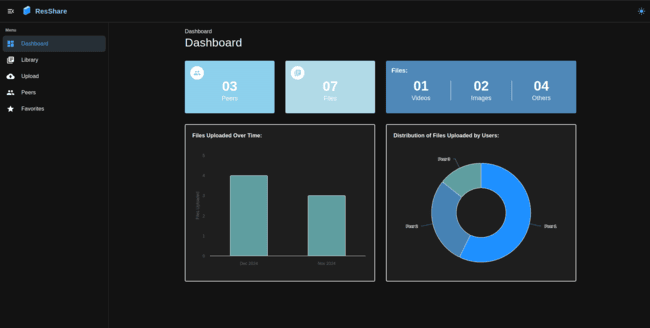
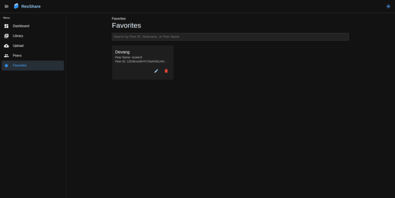

# ResShare
## A ResilientDB App

## Introduction

**ResShare** is a decentralized file-sharing system built on ResilientDB and IPFS,that allows transferring any types of files with no limit on size of the file. Unlike traditional platforms, ResShare eliminates single points of failure by combining ResilientDB's tamper-proof metadata storage with IPFS's distributed file system. The platform enables secure file uploads, retrievals, and deletions while ensuring efficient management of metadata.
## Key Features

### Decentralized File Storage
- Files are distributed across the IPFS Cluster network, removing any single points of failure.
- Redundant storage ensures file availability even during network disruptions.

### Tamper-Proof Metadata
- Metadata such as CIDs and file details are securely stored in ResilientDB.
- Immutability guarantees reliable verification during file retrieval and deletions.

### Data Integrity Verification
- File integrity is validated by comparing the retrieved file's hash with stored metadata.
- Prevents tampering or corruption in storage and retrieval processes.

### Custom IPFS ClusterService Integrations
- Users can setup their own cluster service and use the ResShare application for private networks.

### Interactive Dashboard
- Provides real-time insights into uploaded files and their statuses.

### Intuitive User Interface
- A responsive interface facilitates seamless file uploads, retrievals, and management.
- Real-time feedback enhances usability and transparency.

## System Architecture

ResShare integrates two core technologies—ResilientDB for metadata management and IPFS Cluster Service for distributed file storage. The following components constitute the system:


Figure 1: Upload File


Figure 2: Fetch and Download File


### Components

#### ResilientDB
- Acts as a key-value store for tamper-proof metadata.
- Ensures high throughput and fault tolerance for metadata operations.

#### IPFS Cluster
- Provides decentralized, redundant file storage.
- Utilizes pinning to ensure file persistence.

#### Backend Services
- Developed in Python and Flask for seamless communication between components.
- Implements API endpoints for file management tasks.

#### Frontend Interface
- Built using ReactJS and Material-UI for an engaging and user-friendly experience.
- Facilitates interaction with the decentralized system.

## Completed Milestones

### System Architecture Design & Setup
- Designed the system architecture integrating ResilientDB and IPFS.
- Deployed ResilientDB for metadata storage with a key-value service.
- Configured an IPFS cluster for distributed file handling.

### Backend Development & Integration
- Developed backend services to bridge ResilientDB, IPFS, and the front-end.
- Established API endpoints for file upload, retrieval, and deletion.
- Implemented mechanisms for managing file metadata securely.

### File Upload, Retrieval, and Deletion
- Enabled secure uploads to IPFS, generating unique CIDs.
- Stored metadata such as file size and owner details in ResilientDB.
- Implemented secure deletion of files and metadata from IPFS and ResilientDB.

### Dashboard Development and UI Enhancements
- Built an interactive dashboard showcasing uploaded files and metadata.
- Enhanced the UI for accessibility, responsiveness, and ease of use.

### Deployment and Testing
- Deployed the platform for production-level testing.
- Conducted comprehensive testing to ensure performance, fault tolerance, and security.

### Documentation and Feedback Analysis
- Finalized comprehensive project documentation.
- Incorporated user feedback to optimize the platform for usability and performance.

## Instructions to Execute

### Backend Setup

### Clone the GithHup Repos
```bash
git clone https://github.com/dr-n0g00d/ResShare-Frontend.git
git clone https://github.com/aj3016/ResShare_Backend.git
```

#### Prerequisites
- GCC and G++
```bash
sudo apt install gcc-11
sudo apt install g++-11
```
- OpenSSL
```bash
sudo apt install openssl libssl-dev
```
- Python 3.8

#### Installation
1. Install C++ dependencies:  
```bash
sudo apt install openssl libssl-dev
```

2. Install Python dependencies:
```bash
pip install -r requirements.txt
```

#### Setup IPFS Cluster Service(Optional)
Set up your own IPFS Cluster Service by following the steps provided on the 
[IPFS Cluster Service Home Page](https://ipfscluster.io/documentation/deployment/setup/).

After setting up, update the URL in the `config/ipfs.config` file.

> **Note**: Share the IPFS Cluster secret key with other nodes that you want to add to the private network.


#### Building the Project
- For Ubuntu 24:  
```bash
  cd bazel 
  bazel build //... --action_env=CC=/usr/bin/gcc-11 --action_env=CXX=/usr/bin/g++-11 --cxxopt="-std=c++17"
```

- For Ubuntu 22:
```bash
cd bazel  
bazel build //...
```

#### Run the Flask Server
- Start the Flask server:  
```bash
export FLASK_APP=controller.py flask run
```
OR  
```bash
python3 controller.py
```

#### Testing
- **Upload a file**:  
```bash
  curl -X POST http://localhost:5000/upload -H "Content-Type: application/json" -d '{"file_path": "Specify file path here"}'
```

- **Get all peers**:  
```bash  
  curl -X GET http://localhost:5000/peers
```

- **Get file status**:  
```bash  
  curl -X GET http://localhost:5000/file_status/(file_cid)
```

- **Download a file**: 
```bash
  curl -X POST http://localhost:5000/download -H "Content-Type: application/json" -d '{"cid": "(file_cid)", "file_path": "Specify file path here""}'
```

- **Get other peer's file structure**:  
```bash
  curl -X GET http://localhost:5000/peer_files/(peer_id)
```

- **Get all files**:  
```bash
  curl -X GET http://localhost:5000/all_files
```

- **Delete a file**:  
```bash
  curl -X POST http://localhost:5000/delete -H "Content-Type: application/json" -d '{"cid": "(file_cid)"}'
```

### Frontend Setup

#### Available Scripts

1. Rename the downloaded directory to "app"

2. Install dependencies:  
```bash
   `npm i`
```

3. Run the app in development mode:  
```bash
   npm start
```
   Open [http://localhost:3000](http://localhost:3000) in your browser.

4. Build the app for production:  
```bash
   npm run build  
```
   Outputs a minified production build in the `build` folder.

## UI



Figure 1 : Dashboard Page


Figure 2 : Library Page


Figure 3 : Upload Page



Figure 4 : Favorite Peers Page


## Conclusion

ResShare demonstrates the potential of decentralized technologies to transform file sharing by addressing challenges of security, scalability, and user control. With its robust architecture, intuitive UI, and comprehensive features, ResShare offers a reliable solution for modern file-sharing needs, setting a strong foundation for future advancements in decentralized systems.

## Future Work

While ResShare has successfully demonstrated the potential of decentralized technologies for file sharing, there are several areas where the platform can be enhanced to address emerging challenges and further improve its capabilities:

1. **End-to-End Encryption**:  
   Implementing end-to-end encryption for files and metadata to enhance security and ensure that only authorized users within the network can access the data.

2. **Access Control Mechanisms**:  
   Introducing granular access controls, such as role-based permissions, to allow users to specify who can view, download the files.

3. **Improved Scalability**:  
   Exploring advanced techniques like sharding or dynamic clustering in IPFS to handle larger datasets and increasing numbers of users effectively.

4. **Mobile Application Development**:  
   Building mobile applications for Android and iOS to expand the accessibility of ResShare and cater to a broader user base.

5. **Improve Performnace**:  
   Reduce the time required to fetch files from ResilientDB and apply filters to view a specific peer's files.

By addressing these areas, ResShare can evolve into a more secure, scalable, and user-centric platform, unlocking new opportunities in decentralized file sharing and beyond.
